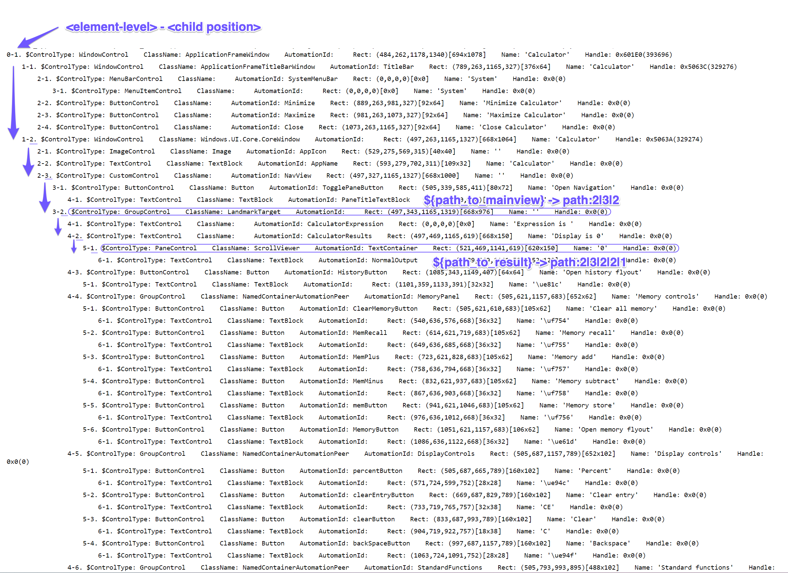
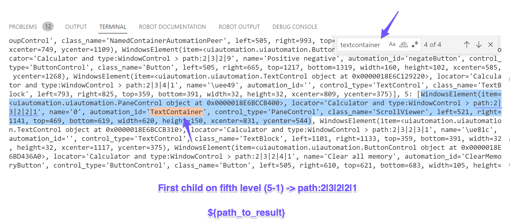

# Using the "path:" locator strategy with the Windows library

This Robot demonstrates how to use a `path:` locator strategy with `RPA.Windows`.

To use the `path:` locator strategy the `rpaframework`, it needs to be installed with a
minimum release of **22.0.0**.

The element path is the last resort method of accessing a Windows application's element
structure, when normal accessibility properties are not available or do not contain
enough information to properly identify elements.

## Understanding the window element tree and element paths

### Basic idea

The Basic idea of the element path is that any element in the application's element
structure can be indexed in a set state given its structure. If the application's
element structure is changing unpredictably, then even the element path itself can't be
used to identify elements.

The Windows **Calculator** is used here as a sample application to show how the element
path works with the `RPA.Windows` library.

*Note:* The Calculator application provides excellent accessibility properties, so in
usual scenarios, you don't need to rely on paths given this.

### Inspecting the element tree and understanding its value

The code below displays output with the [Print Tree](https://robocorp.com/docs/libraries/rpa-framework/rpa-windows/keywords#print-tree)
keyword in the robot file. I am specifically logging elements as warnings so that the
output is visible in both the terminal and on top of the log file.

```robotframework
Print Tree    log_as_warnings=${True}
```

Additionally, you can return the Windows element structure and interact directly with
those `WindowsElement` objects, as they are compatible with all our `RPA.Windows`
keywords.

```robotframework
${structure} =   Print Tree   log_as_warnings=${True}    return_structure=${True}
```

Each entry is prefixed with 2 numbers (check the image below):
**_\<element level\>_ - _\<child position\>_**

- The first number indicates the **depth level of the element** in the element tree.
  As a reminder, the default search depth in `RPA.Windows` is **8** (which applies also
  to the `Print Tree` keyword). Search depth can be changed with the
  `search_depth`/`max_depth` parameters, see [library documentation](https://robocorp.com/docs/libraries/rpa-framework/rpa-windows)
  for more. (a level of `0` indicates the root and your path composition starts with
  the first child under that)
- The second number indicates the **position of the element under its current level**
  (number 1 indicating the first child) in the element tree.
  **These positions are used as values when creating a path for the element locator**.

⚠️ The root element position (here the `WindowControl` of the **Calculator** application)
**is not** part of the element path-based locator. Indexing starts from the depth level
of `1`. (as `0` is the singular root level which is already your default active window
if it was previously controlled; you can also set it as an anchor)

### How the value of the `path:` locator is formed

In our **Calculator** robot, all the elements of interest are descending from the root
element assigned to the variable `${path_to_mainview}`.

To get an element path for the `${path_to_mainview}`, I can see from the image below
that its locator starts on the second position (under the parent window), which is
"1-2", and then we select the third child ("2-3"), and finally the 2nd next child
("3-2"). This translates into the final element path-based locator of value:
`path:2|3|2`.

> The pipe character (`|`) is used for separating the positions when jumping from level
> to level. (starting with level `1` and onwards until you stop for the element of
> interest)

Now I can use this as a new parent/prefix (instead of the Calculator root window) for
the rest of my locators. (to avoid redundancy)

```robotframework
${path_to_mainview}         path:2|3|2
${path_to_result}           ${path_to_mainview}|2|1  # path:2|3|2|2|1
```

The `path:` strategy can be combined with other locator strategies as well.

```robotframework
${locator_to_number_five}       path:2|3|2 > id:num5Button
```

The rest of the locator variables, based on the `path:` strategy, are computed in the
same way I described above.

*Tree printed log*:


*Tree returned structure*:


## How the robot works

This robot is just entering six random numbers into the **Calculator** app
(after opening it) and either adds or subtracts these numbers.

```robotframework
*** Settings ***
Documentation       Using the element path strategy when locating application elements.

Library             RPA.Windows


*** Variables ***
${path_to_mainview}             path:2|3|2
${path_to_result}               ${path_to_mainview}|2|1    # path:2|3|2|2|1
# Different element sections
${path_to_controls}             ${path_to_mainview}|5    # path:2|3|2|5
${path_to_operators}            ${path_to_mainview}|7    # path:2|3|2|7
${path_to_numberpad}            ${path_to_mainview}|8    # path:2|3|2|8
# Clear button in Controls section
${path_to_clear_button}         ${path_to_controls}|3    # path:2|3|2|5|3
# Buttons in Operators section
${path_to_minus_button}         ${path_to_operators}|3    # path:2|3|2|7|3
${path_to_plus_button}          ${path_to_operators}|4    # path:2|3|2|7|4
${path_to_equals_button}        ${path_to_operators}|5    # path:2|3|2|7|5
${locator_to_number_five}       path:2|3|2 > id:num5Button


*** Tasks ***
Automate Calculator
    [Setup]    Windows Run    calc.exe

    # Display the element tree of the Calculator window.
    Control Window    Calculator
    ${structure} =    Print Tree    log_as_warnings=${True}    return_structure=${True}
    Log To Console    Structure: ${structure}

    # Clear display and add/subtract random numbers.
    Click    ${path_to_clear_button}
    ${operations} =    Set Variable    ${EMPTY}
    FOR    ${_}    IN RANGE    6
        ${number} =    Evaluate    random.randint(1,9)
        IF    ${number} % 2 == 0
            Click    ${path_to_plus_button}
            ${operations} =    Set Variable    ${operations}+
        ELSE
            Click    ${path_to_minus_button}
            ${operations} =    Set Variable    ${operations}-
        END
        ${operations} =    Set Variable    ${operations}${number}
        Click    ${path_to_numberpad} > path:${number + 1}    wait_time=0.5
    END

    # Generate result and extract the total from display.
    Click    ${path_to_equals_button}
    ${result} =    Get Element    ${path_to_result}
    ${operations} =    Set Variable    ${operations}=${result.name}
    Log    Calculated expression: ${operations}

    # Lets add number "5" to the total by pressing this key. (on Windows 11 it replaces
    #  the result)
    Click    ${locator_to_number_five}

    [Teardown]    Close Current Window
```

## Learning materials

- [Robocorp Developer Training Courses](https://robocorp.com/docs/courses)
- [Documentation links on Robot Framework](https://robocorp.com/docs/languages-and-frameworks/robot-framework)
- [Example bots in Robocorp Portal](https://robocorp.com/portal)
