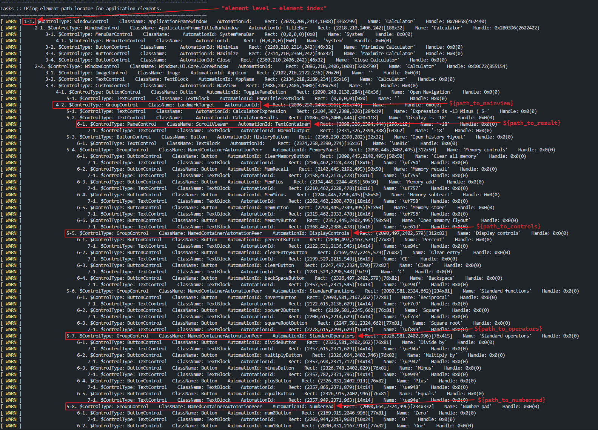

# Using 'path:' locator strategy with Windows library

This Robot demonstrates how to use `path:` locator strategy with `RPA.Windows`. 

To use `path:` locator strategy the `rpaframework` needs to be installed with minimum release of **22.0.0**.

The element path is a last gap method of accessing a Windows application's element structure when normal accessibility 
properties are not available or do not contain enough information to properly identify elements.

## Understanding the window element tree and element paths

### Basic idea

Basic idea of the element path is that any element in the application's element structure can be indexed in a set state of
an application. If the application's element structure is changing unpredictably then even element path can't be used
to identify elements.

The Windows Calculator is used here as an sample application to show how element path works with the `RPA.Windows` library (*note.* Calculator
application provides excellent accessibility properties so in the normal case there would not be need to use element path with
this application).

### Inspecting the element tree and understanding the values

Below image shows output from the `Print Tree` keyword in the Robot file. I am specifically logging elements as warnings so that the output is visible in
the Robot terminal.

```robot
Print Tree    log_as_warnings=True
```

Each entry is prefixed with 2 numbers (in the image **"element level -element index"**). 

- The first number indicates the **depth level of the element** in the element tree. 
As a reminder the default search depth in the RPA.Windows is **8** (which applies also to `Print Tree` keyword). Search depth can be changed, 
see [library documentation](https://robocorp.com/docs/libraries/rpa-framework/rpa-windowss) for more information.
- The second number indicates the **index of the element on its current level** (number 1 indicating the first element) on the element tree. 
**This number is used as an value when creating a path for the element**. The root element index (in this case WindowControl of the Calculator application) 
**is not** part of the element path index. Indexing starts from the depth level 2.

### How value for `path:` locator is calculated ?

In my Calculator Robot all elements of interest are contained within the element which I have assigned to variable `${path_to_mainview}`.

To get element path for the `${path_to_mainview}` I can see from image that it is locator under the second index (under the parent window) "2-2" and then 
under the third index of that structure "3-3" and finally under the second index of that structure "4-2". This gives the element path value of `2|3|2`. 
The "calculation path" is indicated by white arrows on the left side of the element tree (shown only on how to get to this "main view").

> pipe character `|` is used as separation character between indexing for different levels of elements

Now I can use this as new parent (instead of Calculator root window) for rest of my locators

```robot
${path_to_mainview}         path:2|3|2
```

The `path:` strategy can be combined with other locator strategies

```robot
${locator_to_number_five}       path:2|3|2 > id:num5Button
```

All the other locator variables based on the `path:` strategy are calculated in the same way I described above.




## The Robot

Robot is just entering six random numbers into the Calculator and either adds or substracts numbers.

```robot
*** Settings ***
Documentation       Using element path locator for application elements.

Library             RPA.Windows


*** Variables ***
${path_to_mainview}             path:2|3|2
${path_to_result}               ${path_to_mainview}|2|1    # path:2|3|2|2|1
# Different element sections
${path_to_controls}             ${path_to_mainview}|5    # path:2|3|2|5
${path_to_operators}            ${path_to_mainview}|7    # path:2|3|2|7
${path_to_numberpad}            ${path_to_mainview}|8    # path:2|3|2|8
# Clear button in Controls section
${path_to_clear_button}         ${path_to_controls}|3    # path:2|3|2|5|3
# Buttons in Operators section
${path_to_minus_button}         ${path_to_operators}|3    # path:2|3|2|7|3
${path_to_plus_button}          ${path_to_operators}|4    # path:2|3|2|7|4
${path_to_equals_button}        ${path_to_operators}|5    # path:2|3|2|7|5
${locator_to_number_five}       path:2|3|2 > id:num5Button


*** Tasks ***
Minimal task
    Control Window    name:Calculator
    Print Tree    log_as_warnings=True
    Click    ${path_to_clear_button}
    ${operations}=    Set Variable    ${EMPTY}
    FOR    ${_}    IN RANGE    6
        ${number}=    Evaluate    random.randint(1,9)
        IF    $number%2 == 0
            Click    ${path_to_plus_button}
            ${operations}=    Set Variable    ${operations}+
        ELSE
            Click    ${path_to_minus_button}
            ${operations}=    Set Variable    ${operations}-
        END
        ${operations}=    Set Variable    ${operations}${number}
        Click    ${path_to_numberpad} > path:${number+1}
        Sleep    0.5s
    END
    Click    ${path_to_equals_button}
    ${result}=    Get Element    ${path_to_result}
    ${operations}=    Set Variable    ${operations}=${result.name}
    Log To Console    \nCalculated: ${operations}
    # Lets add 5 more to the result
    Click    ${locator_to_number_five}
    Log    Done.
```

## Learning materials

- [Robocorp Developer Training Courses](https://robocorp.com/docs/courses)
- [Documentation links on Robot Framework](https://robocorp.com/docs/languages-and-frameworks/robot-framework)
- [Example bots in Robocorp Portal](https://robocorp.com/portal)
