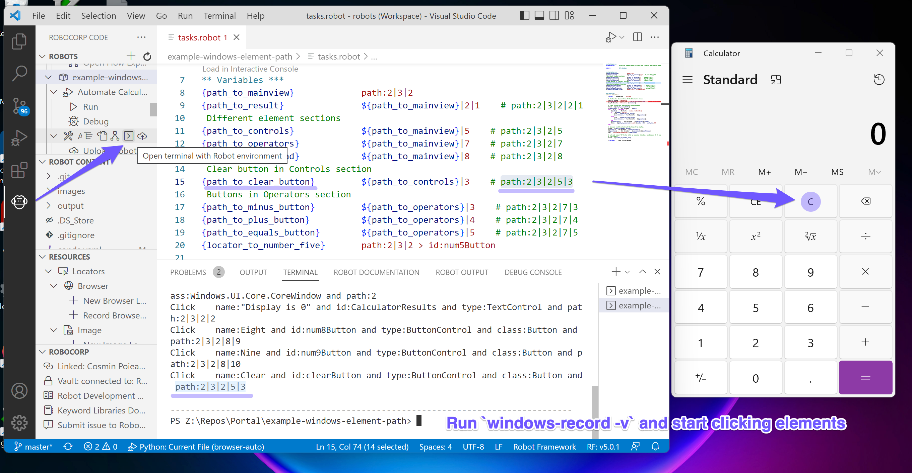

# Using the "path:" locator strategy with the Windows library

This Robot demonstrates how to use a `path:` locator strategy with `robocorp` libraries.

(although we recommend you to update to the latest version to benefit from all the
fixes and features we brought lately)

The element path is the last resort method of accessing a Windows application's element
structure, when normal accessibility properties are not available or do not contain
enough information to properly identify elements.

## Understanding the window element tree and element paths

### Main idea

The Basic idea of the element path is that any element in the application's element
structure can be indexed in a set state given its structure. If the application's
element structure is changing unpredictably, then even the element path itself can't be
used to identify elements.

The Windows **Calculator** is used here as a sample application to show how the element
path works with the `robocorp-windows` library.

> *Note:* The Calculator application provides excellent accessibility properties, so in
usual scenarios, you don't need to rely on paths given this.

### Inspecting the element tree and understanding its value
Each entry is prefixed with 2 numbers (check the image below):
**_\<element level\>_ - _\<child position\>_**

- The first number indicates the **depth level of the element** in the element tree.
  As a reminder, the default search depth in `robocorp-windows` is **8** (which applies also
  to the `print_tree` function). Search depth can be changed with the `max_depth` parameter.
  A level of `0` indicates the root and your path composition starts with
  the first child under that.
- The second number indicates the **position of the element under its current level**
  (number 1 indicating the first child) in the element tree.
  **These positions are used as values when creating a path for the element locator**.

⚠️ The root element position (here the `WindowControl` of the **Calculator** application)
**is not** part of the element path-based locator. Indexing starts from the depth level
of `1`. (as `0` is the singular root level which is already your default active window
if it was previously controlled.

### How the value of the `path:` locator is formed

In our **Calculator** robot, all the elements of interest are descending from the root
element assigned to the variable `${path_to_mainview}`.

To get an element path for the `${PATH_TO_MAINVIEW}`, I can see from the image below
that its locator starts on the second position (under the parent window), which is
"**1-2**", and then we select the third child ("**2-3**"), and finally the 2nd next
child ("**3-2**"). This translates into the final element path-based locator of value:
`path:2|3|2`.

> The pipe character (`|`) is used for separating the positions when jumping from level
to level. (starting with level `1` and onwards until you stop at the element of
interest)

Now I can use this as a new parent/prefix (instead of the Calculator root window) for
the rest of my locators. (to avoid redundancy)

```python
PATH_TO_MAINVIEW = "path:2|3|2"
PATH_TO_RESULT = f"{PATH_TO_MAINVIEW}|2|1" # path:2|3|2|2|
```

The `path:` strategy can be combined with other locator strategies as well.

```python
PATH_TO_TO_NUMBER_FIVE = "path:2|3|2 > id:num5Button"
```

The rest of the locator variables, based on the `path:` strategy, are computed in the
same way I described above.

*Tree printed log*:


*Tree returned structure*:


### An element recorder for your convenience

Tired of counting child positions and remembering indexes? We've got your back with our
own `windows-record` script which is capable of displaying such complete paths
starting with the currently controlled window (the root of the element tree) until the
element you just clicked.

Get a shell into the robot environment and run the script with `windows-record -v`.



Here's a recorded demo to see it in action:
https://www.loom.com/share/2807372359f34b9cbe1bc2df9194ec68

## How the robot works

This robot is just entering six random numbers into the **Calculator** app
(after opening it) and either adds or subtracts these numbers.

## Learning materials

- [Robocorp Developer Training Courses](https://robocorp.com/docs/courses)
- [Example bots in Robocorp Portal](https://robocorp.com/portal)
